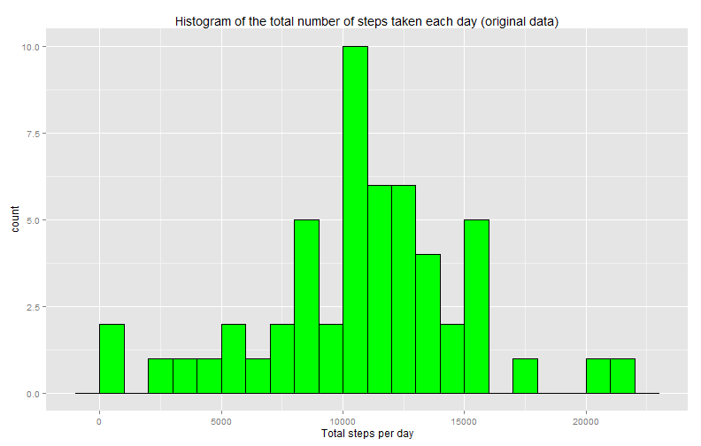
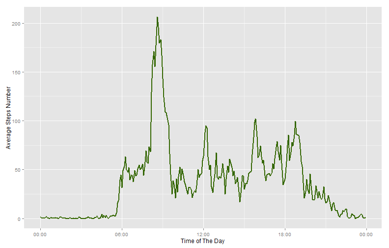
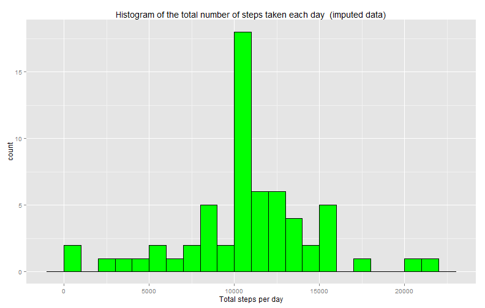
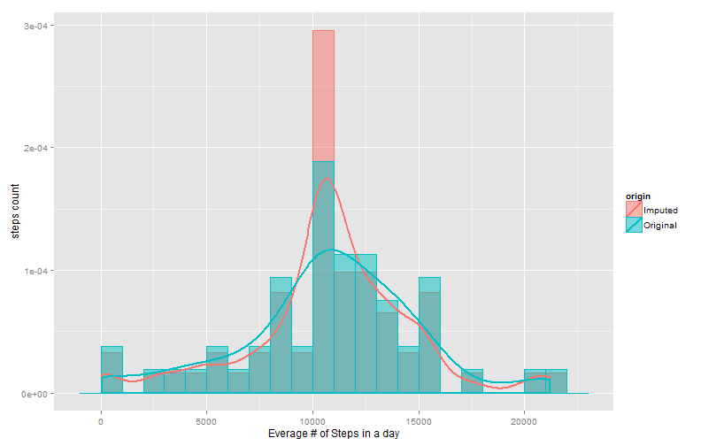
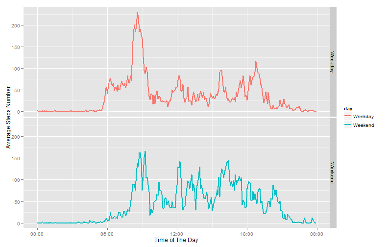

# Reproducible Research: Peer Assessment 1

Decription: This document describes analysis steps as required in the assignment.  
Introduction: This assignment makes use of data from a personal activity monitoring device. This device collects data at 5 minute intervals through out the day. The data consists of two months of data from an anonymous individual collected during the months of October and November, 2012 and include the number of steps taken in 5 minute intervals each day.

## Loading and preprocessing the data


```r
#Load the Libraries 
library("scales")
library("ggplot2")
```

In this data set we are expecting to find the following fields:

  - steps: Number of steps taking in a 5-minute interval (missing values are coded as NA)  
  - date: The date on which the measurement was taken in YYYY-MM-DD format  
  - interval: Identifier for the 5-minute interval in which measurement was taken  

With Total 17,568 observations


```r
#Load and review the data for further analysis 
unzip("activity.zip")
Data<-read.csv( "activity.csv")
str(Data)
```

```
## 'data.frame':	17568 obs. of  3 variables:
##  $ steps   : int  NA NA NA NA NA NA NA NA NA NA ...
##  $ date    : Factor w/ 61 levels "2012-10-01","2012-10-02",..: 1 1 1 1 1 1 1 1 1 1 ...
##  $ interval: int  0 5 10 15 20 25 30 35 40 45 ...
```


## What is mean total number of steps taken per day?


```r
#Summarize the data by summing the steps taken each day and calculate mean and median  
MeanSumStepsByDate<-aggregate(steps ~ date, Data, sum)
#Convert them to characters to avoid reformatting by knitr
MeanStepsPerDay<-as.character(round(mean(MeanSumStepsByDate$steps, na.rm=TRUE),1))
MedianStepsPerDay<-as.character(median(MeanSumStepsByDate$steps, na.rm=TRUE))

#Make the required histogram of the total number of steps taken each day and annotate it 
g<-ggplot(MeanSumStepsByDate, aes(x=steps))
g + geom_histogram(colour="black", fill="green",binwidth = 1000)+ 
  labs(title = "Histogram of the total number of steps taken each day (original data)")+
  labs(x="Total steps per day")
```

 

- Mean total number of steps taken per day is 10766.2  
- Median total number of steps taken per day is 10765


## What is the average daily activity pattern?

```r
#Summarize the data by calculating the mean number of steps per interval accross all days
##then convert the interval to the actual time of day 
MeanSumStepsByDateInt<-aggregate(steps ~ interval, Data, mean,na.rm=TRUE)
MeanSumStepsByDateInt$IntervalDateTime<-strptime(sprintf("%04d", MeanSumStepsByDateInt$interval),"%H%M")

#Find the index of the interval with max average number of steps
MaxStepsIntervalInd<-which(MeanSumStepsByDateInt$steps==max(MeanSumStepsByDateInt$steps))
IntervalStart<-format(strptime(sprintf("%04d", MeanSumStepsByDateInt$interval[MaxStepsIntervalInd]),"%H%M"),"%H:%M")
IntervalEnd<-format(strptime(sprintf("%04d", MeanSumStepsByDateInt$interval[MaxStepsIntervalInd+1]),"%H%M"),"%H:%M")

#Make a time series plot of the 5-minute interval and the average number of steps taken, averaged across all days
g <- ggplot(MeanSumStepsByDateInt, aes(x=IntervalDateTime, y=steps))
g + geom_line(colour="#336600",size = 1) + 
    xlab("Time of The Day")+ 
    ylab("Average Steps Number")+
    scale_x_datetime(labels = date_format("%H:%M"))
```

 
The following 5-minute interval, on average across all the days in the dataset,  
contains the maximum number of steps: 08:35 - 08:40


## Imputing missing values

```r
NAnumber<-sum(is.na(Data$steps))
```
Total number of missing values in the dataset is 2304  
Imputing strategy: earlier calculated mean value for a given time interval will be used for filling in all of the missing values in the dataset. 


```r
#Join the original data frame with the summary table 
ImputedData<- merge(Data, MeanSumStepsByDateInt, by.x = "interval", by.y = "interval")

#replace missing values with interval averages
ImputedData$steps.x[is.na(ImputedData$steps.x)] <- ImputedData$steps.y[is.na(ImputedData$steps.x)]

#tidy the dataset
ImputedData$steps.y <- NULL
names(ImputedData)[names(ImputedData)=="steps.x"] <- "steps"

#Summarize the new clean data by summing the steps taken each day and calculate mean and median  
MeanSumStepsByDateI<-aggregate(steps ~ date, ImputedData, sum)

#Convert them to characters to avoid reformatting by knitr
MeanStepsPerDayI<-as.character(round(mean(MeanSumStepsByDateI$steps),1))
MedianStepsPerDayI<-as.character(round(median(MeanSumStepsByDateI$steps),1))

#Make the required histogram of the total number of steps taken each day and annotate it 
g<-ggplot(MeanSumStepsByDateI, aes(x=steps))
g + geom_histogram(colour="black", fill="green",binwidth = 1000)+ 
  labs(title = "Histogram of the total number of steps taken each day  (imputed data)")+
  labs(x="Total steps per day")
```

 
On the imputed data
- Mean total number of steps taken per day is 10766.2  
- Median total number of steps taken per day is 10766.2

These values are almost no different from the estimates from the first part of the assignment.
With the selected imputing strategy, the impact of imputing missing data on the estimates of the the daily total number of steps is minimal to none. The following chart will illustrate how close the underlying histograms are, and why we should expect similar summary statistics.


```r
#Add the source column to the original and imputed summary tables
MeanSumStepsByDate$origin<-rep("Original",nrow(MeanSumStepsByDate))
MeanSumStepsByDateI$origin<-rep("Imputed",nrow(MeanSumStepsByDateI))

#stack the tables to create aconsolidated dataset to be plotted together
CombinedDt1<-rbind(MeanSumStepsByDate,MeanSumStepsByDateI)

#compare the histograms of daily averages of total steps from original and imputed data sets
g<-ggplot(CombinedDt1, aes(x=steps, fill=origin, colour=origin))  
g+geom_histogram(aes(y=..density..),binwidth=1000, alpha=.5, position="identity")+
  geom_density(alpha=0,size = 1)+xlab("Everage # of Steps in a day")+ylab("steps count")
```

 


## Are there differences in activity patterns between weekdays and weekends?

```r
#Add columns to the data frame that identify the day kind
ImputedData$wday<-weekdays(as.POSIXlt (ImputedData$date))
ImputedData$day[ImputedData$wday %in% c('Saturday','Sunday')]<-"Weekend"
ImputedData$day[!ImputedData$wday %in% c('Saturday','Sunday')]<-"Weekday"
ImputedData = transform(ImputedData, day = factor(day))

#Summarize the data by calculating the mean number of steps per interval accross all days
##then convert the interval to the actual time of day
MeanSumStepsByDateI<-aggregate(steps ~ day+interval, ImputedData, mean)
MeanSumStepsByDateI$IntervalDateTime<-strptime(sprintf("%04d", MeanSumStepsByDateI$interval),"%H%M")


#Make a time series plot of the 5-minute interval and the average number of steps taken, averaged across all days
g <- ggplot(MeanSumStepsByDateI, aes(x=IntervalDateTime, y=steps, colour=day))
g + geom_line(size=1) + 
    xlab("Time of The Day") + 
    ylab("Average Steps Number") +
    scale_x_datetime(labels = date_format("%H:%M"))+facet_grid(day~.)
```

 
